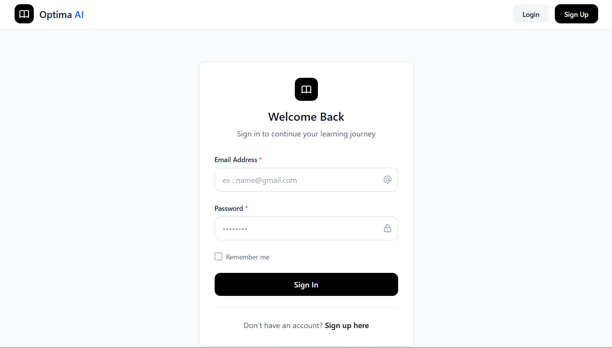
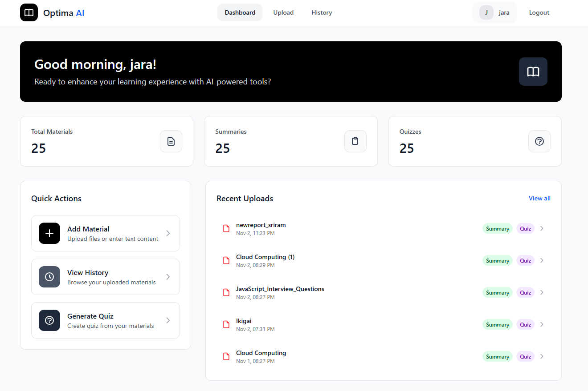
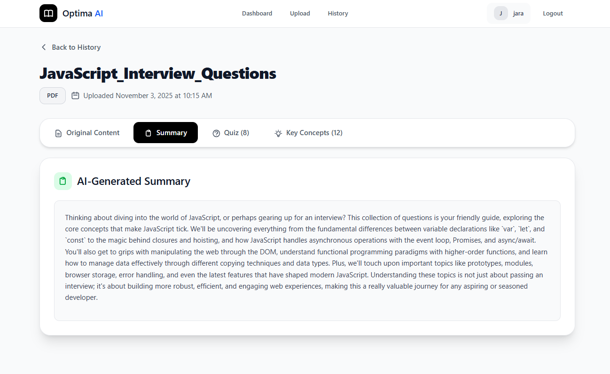
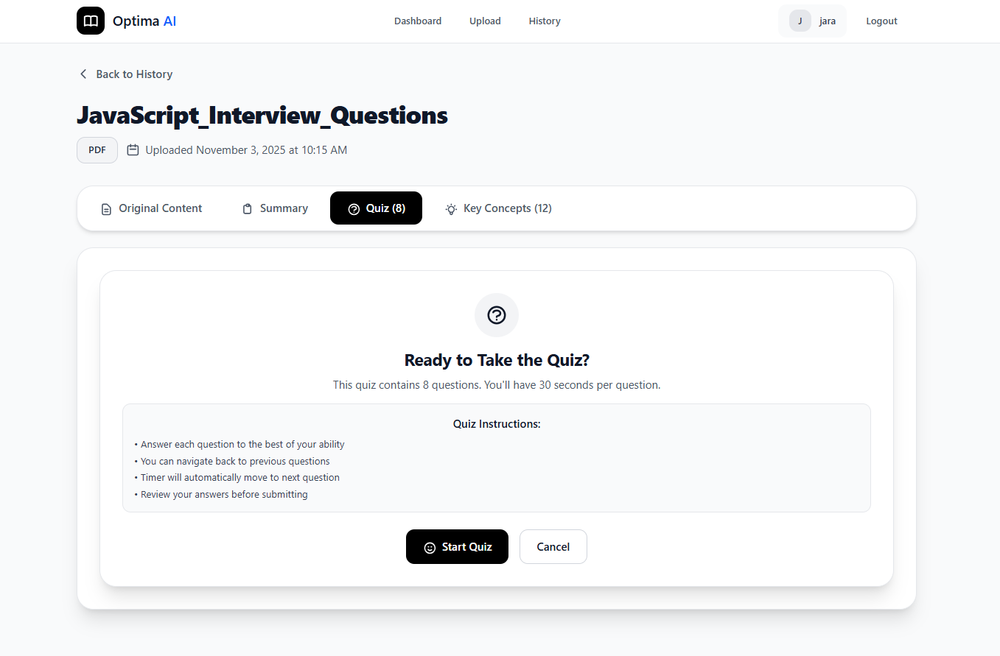
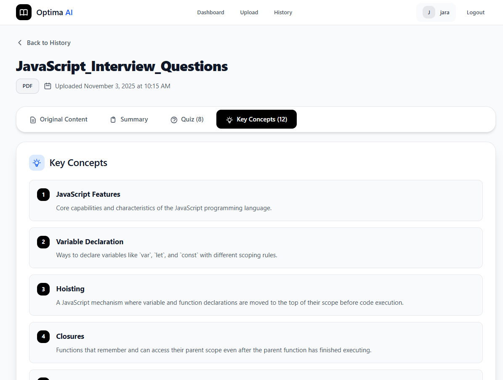
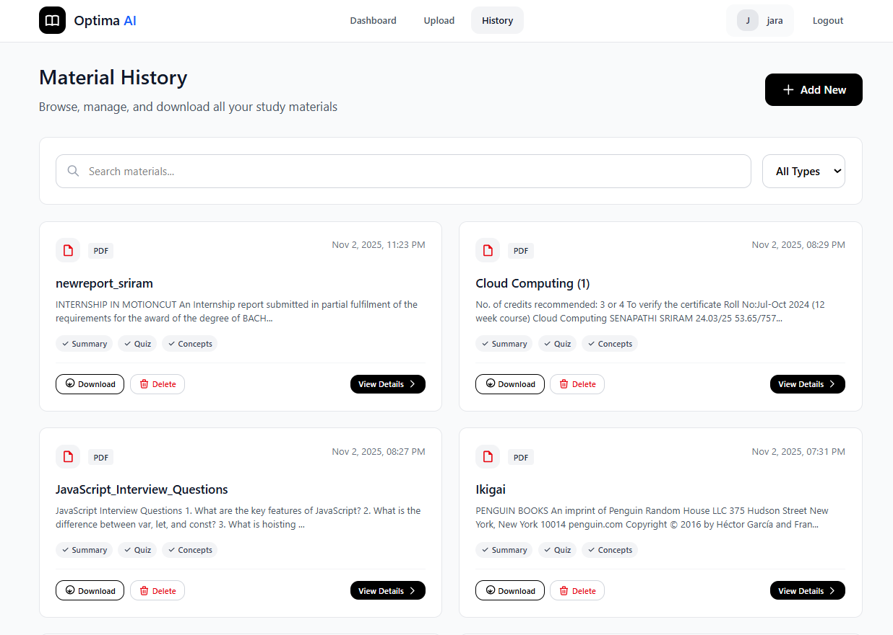

# Optima AI - Smart Study Assistant

An AI-powered study assistant that helps students learn smarter with automatic summaries, quiz generation, and key concepts extraction using Google Gemini AI.

   !

---

## 📑 Table of Contents

1. [Overview](#overview)
2. [Features](#features)
3. [Tech Stack](#tech-stack)
4. [System Architecture](#system-architecture)
5. [Prerequisites](#prerequisites)
6. [Installation & Setup](#installation--setup)
7. [Database Setup](#database-setup)
8. [API Documentation](#api-documentation)
9. [Usage Guide](#usage-guide)
10. [Screenshots](#screenshots)
11. [Development Process](#development-process)
12. [Challenges & Solutions](#challenges--solutions)
13. [Deployment](#deployment)
14. [Links](#links)

---

## 🎯 Overview

Optima AI is a comprehensive study assistant platform that leverages Large Language Models (LLM) to enhance the learning experience. Students can upload study materials (PDFs or text), and the system automatically generates:

- **Concise Summaries**: Key points and takeaways
- **Interactive Quizzes**: Multiple-choice, true/false, and short-answer questions
- **Key Concepts**: Important terms with clear explanations

The platform uses Google Gemini AI for intelligent content processing and provides a clean, intuitive interface for effective studying.

---

## ✨ Features

### Core Features
- 📚 **Material Upload**: Support for PDF files and direct text input
- 🤖 **AI-Powered Processing**: Automatic content analysis using Google Gemini
- 📝 **Smart Summaries**: Concise, well-structured summaries with key points
- 🎯 **Quiz Generation**: Diverse question types for effective revision
- 💡 **Concept Extraction**: Key terms with one-line explanations
- 📊 **Study History**: Track all uploaded materials and progress
- 🏆 **Quiz Scoring**: Instant feedback with detailed explanations
- 🔐 **Secure Authentication**: JWT-based user authentication
- ☁️ **Cloud Storage**: Secure file storage with Supabase
- 🎨 **Responsive Design**: Works seamlessly on desktop and mobile

### Technical Features
- RESTful API architecture
- Real-time content processing
- Optimized database queries
- CORS-enabled for cross-origin requests
- Docker containerization support
- Production-ready deployment configuration

---

## 🛠️ Tech Stack

### Frontend
| Technology | Version | Purpose |
|------------|---------|---------|
| React | 18.2.0 | UI Framework |
| Vite | 5.0.0 | Build Tool |
| Tailwind CSS | 3.4.0 | Styling |
| React Router | 6.20.0 | Routing |
| Axios | 1.6.2 | HTTP Client |
| React Hot Toast | 2.4.1 | Notifications |

### Backend
| Technology | Version | Purpose |
|------------|---------|---------|
| FastAPI | 0.104.1 | Web Framework |
| Python | 3.12 | Programming Language |
| PostgreSQL | 15 | Database |
| SQLAlchemy | 2.0.23 | ORM |
| Google Gemini AI | 0.8.3 | LLM Processing |
| Supabase | 2.9.0 | Storage & Auth |
| PyPDF2 | 3.0.1 | PDF Processing |
| python-jose | 3.3.0 | JWT Authentication |

### DevOps
- Docker & Docker Compose
- Uvicorn (ASGI Server)
- Git & GitHub
- Render (Deployment)

---

## 🏗️ System Architecture

```
┌─────────────────────────────────────┐
│  Frontend (React + Vite)            │
│  http://localhost:5173              │
└─────────────────────────────────────┘
              ↓ API calls
┌─────────────────────────────────────┐
│  Backend (FastAPI + Python)         │
│  http://localhost:8000              │
│  ├── Authentication (JWT)           │
│  ├── Material Processing            │
│  ├── AI Integration (Gemini)        │
│  └── Storage (Supabase)             │
└─────────────────────────────────────┘
              ↓ Database queries
┌─────────────────────────────────────┐
│  Database (PostgreSQL)              │
│  localhost:5432                     │
│  ├── Users                          │
│  ├── Materials                      │
│  └── Generated Data                 │
└─────────────────────────────────────┘
```

---

## 📋 Prerequisites

Before you begin, ensure you have the following installed:

- **Python**: 3.12 or higher
- **Node.js**: 20.19 or higher
- **PostgreSQL**: 15 or higher (or Supabase account)
- **Docker**: Latest version (optional, for containerized setup)
- **Git**: For version control

### Required API Keys
- **Google Gemini API Key**: [Get it here](https://makersuite.google.com/app/apikey)
- **Supabase Account**: [Sign up here](https://supabase.com)

---

## 🚀 Installation & Setup

### Option 1: Local Development Setup

#### 1. Clone the Repository
```bash
git clone https://github.com/Sriram-098/optima-AI
cd optima-ai
```

#### 2. Backend Setup
```bash
# Navigate to server directory
cd server

# Create virtual environment
python -m venv venv

# Activate virtual environment
# On Windows:
venv\Scripts\activate
# On macOS/Linux:
source venv/bin/activate

# Install dependencies
pip install -r requirements.txt

# Create .env file
copy .env.example .env  # Windows
# OR
cp .env.example .env    # macOS/Linux

# Edit .env and add your credentials:
# - DATABASE_URL
# - GEMINI_API_KEY
# - SUPABASE_URL
# - SUPABASE_ANON_KEY
# - SUPABASE_SERVICE_ROLE_KEY
# - JWT_SECRET

# Run database migrations (if needed)
python init_db.py

# Start the backend server
python -m uvicorn app.main:app --reload --host 0.0.0.0 --port 8000
```

Backend will be available at: **http://localhost:8000**

#### 3. Frontend Setup
```bash
# Open a new terminal
cd client

# Install dependencies
npm install

# Create .env file
copy .env.example .env  # Windows
# OR
cp .env.example .env    # macOS/Linux

# Edit .env and set:
# VITE_API_URL=http://localhost:8000

# Start the development server
npm run dev
```

Frontend will be available at: **http://localhost:5173**

### Option 2: Docker Setup

#### 1. Prerequisites
- Docker Desktop installed and running

#### 2. Start All Services
```bash
# Clone the repository
git clone https://github.com/Sriram-098/optima-AI.git
cd optima-ai

# Create .env file in root directory
copy .env.example .env  # Windows
# OR
cp .env.example .env    # macOS/Linux

# Edit .env and add your API keys

# Start all services
docker-compose up -d

# View logs
docker-compose logs -f

# Stop services
docker-compose down
```

#### 3. Access Services
- **Frontend**: http://localhost:5173
- **Backend**: http://localhost:8000
- **API Docs**: http://localhost:8000/docs
- **Database**: localhost:5432

---

## 🗄️ Database Setup

### Database Schema

The application uses PostgreSQL with the following tables:

#### 1. Users Table
```sql
CREATE TABLE users (
    id SERIAL PRIMARY KEY,
    username VARCHAR(255) UNIQUE NOT NULL,
    email VARCHAR(255) UNIQUE NOT NULL,
    hashed_password VARCHAR(255) NOT NULL,
    created_at TIMESTAMP DEFAULT CURRENT_TIMESTAMP
);
```

#### 2. Materials Table
```sql
CREATE TABLE materials (
    id SERIAL PRIMARY KEY,
    title VARCHAR(500) NOT NULL,
    content TEXT NOT NULL,
    file_type VARCHAR(50),
    file_url TEXT,
    user_id INTEGER REFERENCES users(id) ON DELETE CASCADE,
    uploaded_at TIMESTAMP DEFAULT CURRENT_TIMESTAMP
);
```

#### 3. Generated Data Table
```sql
CREATE TABLE generated_data (
    id SERIAL PRIMARY KEY,
    material_id INTEGER REFERENCES materials(id) ON DELETE CASCADE,
    summary TEXT,
    quiz_questions TEXT,
    key_concepts TEXT,
    created_at TIMESTAMP DEFAULT CURRENT_TIMESTAMP
);
```

### Database Initialization

#### Automatic Initialization
The application automatically creates tables on first run using SQLAlchemy ORM.

#### Manual Initialization
If you need to manually initialize the database:

```bash
cd server
python init_db.py
```

### Sample Data (Optional)
To insert sample data for testing:

```sql
-- Insert a test user
INSERT INTO users (username, email, hashed_password) 
VALUES ('testuser', 'test@example.com', '$2b$12$hashed_password_here');

-- Insert sample material
INSERT INTO materials (title, content, file_type, user_id) 
VALUES (
    'Introduction to Python',
    'Python is a high-level programming language...',
    'text',
    1
);
```

---

## 📚 API Documentation

### Accessing API Documentation

The API documentation is automatically generated using FastAPI's built-in Swagger UI.

**Access at**: http://localhost:8000/docs

### API Endpoints Overview

#### Authentication Endpoints
| Method | Endpoint | Description |
|--------|----------|-------------|
| POST | `/auth/register` | Register new user |
| POST | `/auth/login` | User login |
| GET | `/auth/me` | Get current user |

#### Materials Endpoints
| Method | Endpoint | Description |
|--------|----------|-------------|
| POST | `/materials/upload-material` | Upload PDF file |
| POST | `/materials/upload-text` | Upload text content |
| GET | `/materials/get-history` | Get user's materials |
| GET | `/materials/{material_id}` | Get specific material |
| DELETE | `/materials/{material_id}` | Delete material |

#### LLM Processing Endpoints
| Method | Endpoint | Description |
|--------|----------|-------------|
| POST | `/llm/generate-summary/{material_id}` | Generate summary |
| POST | `/llm/generate-quiz/{material_id}` | Generate quiz |
| POST | `/llm/extract-concepts/{material_id}` | Extract concepts |

### Example API Requests

#### 1. Register User
```bash
curl -X POST "http://localhost:8000/auth/register" \
  -H "Content-Type: application/json" \
  -d '{
    "username": "john_doe",
    "email": "john@example.com",
    "password": "securepassword123"
  }'
```

#### 2. Login
```bash
curl -X POST "http://localhost:8000/auth/login" \
  -H "Content-Type: application/x-www-form-urlencoded" \
  -d "username=john_doe&password=securepassword123"
```

#### 3. Upload Material
```bash
curl -X POST "http://localhost:8000/materials/upload-material?title=My%20Notes" \
  -H "Authorization: Bearer YOUR_JWT_TOKEN" \
  -F "file=@/path/to/document.pdf"
```


## 📖 Usage Guide

### 1. Getting Started

1. **Register an Account**
   - Navigate to http://localhost:5173
   - Click "Sign Up"
   - Enter username, email, and password
   - Click "Create Account"

2. **Login**
   - Enter your credentials
   - Click "Login"

### 2. Uploading Study Material

#### Option A: Upload PDF
1. Click "Upload" in the navigation
2. Select "File Upload" tab
3. Enter a title for your material
4. Click "Choose File" and select a PDF
5. Click "Upload & Process with AI"

#### Option B: Paste Text
1. Click "Upload" in the navigation
2. Select "Text Input" tab
3. Enter a title
4. Paste or type your content (minimum 50 characters)
5. Click "Upload & Process with AI"

### 3. AI Processing

After upload, the system automatically:
- Extracts text from PDF (if applicable)
- Generates a concise summary
- Creates quiz questions
- Extracts key concepts

Processing typically takes 10-30 seconds depending on content length.

### 4. Studying with Generated Content

#### View Summary
- Click on the "Summary" tab
- Read the AI-generated summary with key points

#### Take Quiz
- Click on the "Quiz" tab
- Click "Take Quiz"
- Answer questions
- Submit to see your score and explanations

#### Review Key Concepts
- Click on the "Key Concepts" tab
- Browse through important terms and their explanations

### 5. Managing Materials

- **View History**: Click "History" to see all uploaded materials
- **Delete Material**: Click the delete icon on any material card
- **Re-process**: Generate new summaries or quizzes anytime

---

## 📸 Screenshots

### 1. SignIn Page

*Clean, modern login interface with Optima AI branding*

### 2. SignUp Page

*Simple and secure user registration*

### 3. Dashboard

*Overview of recent uploads and quick actions*

### 4. Upload Interface

*Support for both PDF upload and direct text input with AI processing info*

### 5. Material View - Summary Tab

*AI-generated concise summary with key points and takeaways*

### 6. Material View - Quiz Tab

*Interactive quiz with multiple question types (MCQ, True/False, Short Answer)*


### 9. Key Concepts Display

*Bold headings with clear one-line explanations in full-width layout*

### 10. Study History

*Track all uploaded materials with search and filter options*


---


---

## 🚧 Challenges & Solutions

### Challenge 1: File Upload Timeout
**Problem**: Large PDF files caused timeout errors during upload and processing.

**Solution**: 
- Separated upload and AI processing into two steps
- Implemented asynchronous processing
- Added progress indicators
- Optimized PDF text extraction

### Challenge 2: Gemini API Rate Limits
**Problem**: Hitting rate limits when processing multiple materials simultaneously.

**Solution**:
- Implemented retry logic with exponential backoff
- Added request queuing system
- Cached frequently accessed results
- Optimized prompt engineering to reduce token usage

### Challenge 3: Database SSL Connection Issues
**Problem**: PostgreSQL connection failed in Docker due to SSL requirements.

**Solution**:
- Added conditional SSL mode based on environment
- Updated connection string to include `sslmode=disable` for local Docker
- Maintained SSL for production Supabase connection

### Challenge 4: CORS Configuration
**Problem**: Frontend couldn't connect to backend due to CORS restrictions.

**Solution**:
- Made CORS origins configurable via environment variables
- Added proper CORS middleware in FastAPI
- Configured Vite to allow specific hosts

### Challenge 5: Quiz Question Quality
**Problem**: AI sometimes generated generic or irrelevant quiz questions.

**Solution**:
- Improved prompt engineering with specific instructions
- Added validation to filter out generic questions
- Implemented retry logic for better quality
- Created fallback quiz generation for edge cases

### Challenge 6: Key Concepts Display Format
**Problem**: Key concepts were returned as HTML/JSON, causing display issues.

**Solution**:
- Standardized format to plain text with markdown
- Updated prompt to return `**Concept Name**\nExplanation` format
- Modified frontend to parse and display correctly

### Challenge 7: Docker Build Failures
**Problem**: Docker build failed due to MySQL client dependencies.

**Solution**:
- Cleaned up requirements.txt to remove unnecessary packages
- Removed MySQL-related dependencies (using PostgreSQL only)
- Updated Dockerfile with correct Node.js version for Vite


---

## 🚀 Deployment

### Deploy to Render

#### 1. Backend Deployment

1. **Create Web Service**
   - Go to [Render Dashboard](https://dashboard.render.com)
   - Click "New +" → "Web Service"
   - Connect your GitHub repository

2. **Configure Service**
   - **Name**: `optima-ai-backend`
   - **Environment**: `Python 3`
   - **Build Command**: `pip install -r server/requirements.txt`
   - **Start Command**: `cd server && uvicorn app.main:app --host 0.0.0.0 --port $PORT`

3. **Environment Variables**
   ```
   DATABASE_URL=your_postgresql_url
   GEMINI_API_KEY=your_gemini_key
   SUPABASE_URL=your_supabase_url
   SUPABASE_ANON_KEY=your_supabase_anon_key
   SUPABASE_SERVICE_ROLE_KEY=your_supabase_service_key
   SUPABASE_STORAGE_BUCKET=study-assistant
   JWT_SECRET=your_jwt_secret
   CORS_ORIGINS=https://your-frontend-url.onrender.com
   ```

4. **Deploy**
   - Click "Create Web Service"
   - Wait for deployment to complete

#### 2. Frontend Deployment

1. **Create Static Site**
   - Click "New +" → "Static Site"
   - Connect your GitHub repository

2. **Configure Site**
   - **Name**: `optima-ai-frontend`
   - **Build Command**: `cd client && npm install && npm run build`
   - **Publish Directory**: `client/dist`

3. **Environment Variables**
   ```
   VITE_API_URL=https://your-backend-url.onrender.com
   ```

4. **Deploy**
   - Click "Create Static Site"
   - Wait for deployment to complete

#### 3. Database Setup

**Option A: Render PostgreSQL**
- Create a PostgreSQL database on Render
- Copy the connection string
- Add to backend environment variables

**Option B: Supabase**
- Use Supabase for both database and storage
- Copy connection string from Supabase dashboard
- Add to backend environment variables

### Deploy with Docker

```bash
# Build images
docker-compose build

# Push to Docker Hub
docker tag optima-ai-backend yourusername/optima-ai-backend
docker push yourusername/optima-ai-backend

# Deploy to your server
ssh your-server
docker pull yourusername/optima-ai-backend
docker-compose up -d
```

---

## 🧪 Testing

### Backend Tests
```bash
cd server
pytest

# With coverage
pytest --cov=app --cov-report=html
```

### Frontend Tests
```bash
cd client
npm test

# With coverage
npm test -- --coverage
```

### Manual Testing Checklist
- [ ] User registration and login
- [ ] PDF file upload
- [ ] Text content upload
- [ ] Summary generation
- [ ] Quiz generation
- [ ] Concept extraction
- [ ] Quiz taking and scoring
- [ ] Material deletion
- [ ] Responsive design on mobile
- [ ] Error handling

---

## 🤝 Contributing

We welcome contributions! Please follow these steps:

1. **Fork the repository**
2. **Create a feature branch**
   ```bash
   git checkout -b feature/amazing-feature
   ```
3. **Commit your changes**
   ```bash
   git commit -m 'Add amazing feature'
   ```
4. **Push to the branch**
   ```bash
   git push origin feature/amazing-feature
   ```
5. **Open a Pull Request**

### Code Style Guidelines
- Follow PEP 8 for Python code
- Use ESLint for JavaScript/React code
- Write meaningful commit messages
- Add comments for complex logic
- Update documentation for new features

---


## 🙏 Acknowledgments

- **Google Gemini AI** - For powerful LLM capabilities
- **Supabase** - For storage and database solutions
- **FastAPI** - For excellent Python web framework
- **React Community** - For amazing frontend tools
- **Tailwind CSS** - For beautiful, utility-first styling

---


## 🔗 Links


---
- **Frontend Application**: https://optima-frontend-u6hi.onrender.com
- **Backend API**: https://optima-backend-4ret.onrender.com

---

